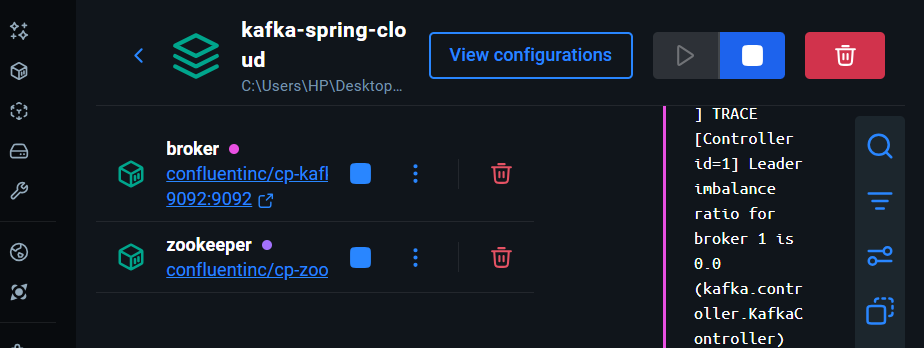
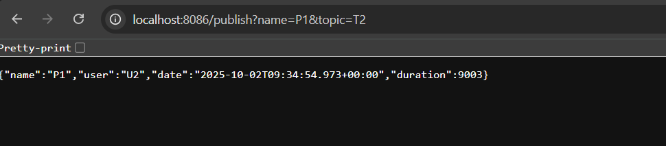
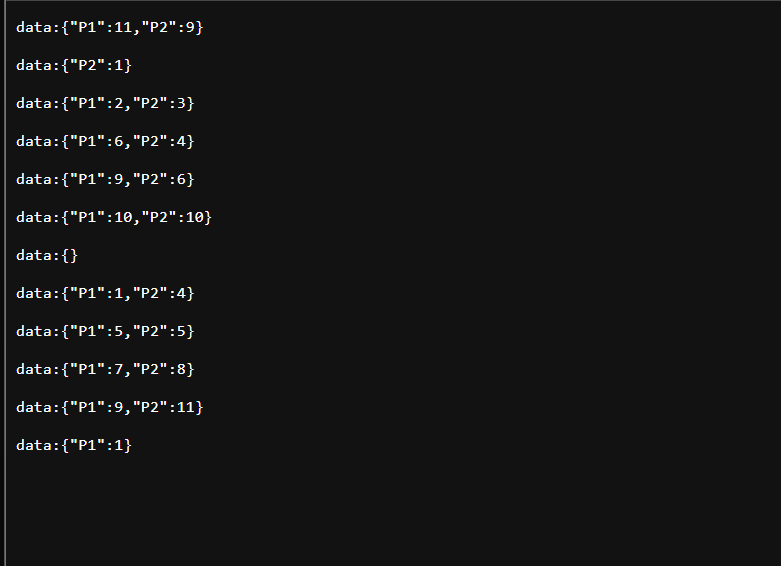
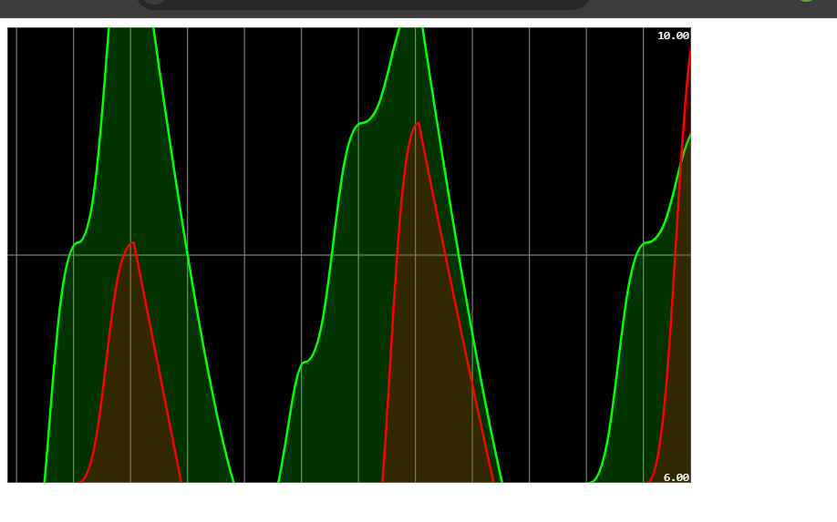

# Kafka + Spring Cloud Stream Project

## 📖 Overview

This project demonstrates how to integrate **Apache Kafka** with **Spring Cloud Stream** to build real-time event-driven applications.  
It includes:

- Kafka Producer (via REST Controller)  
- Kafka Consumer  
- Kafka Supplier  
- Real-Time Data Analytics with **Kafka Streams**  
- A Web Application to visualize analytics results in real time  

---

## ⚙️ Prerequisites

- Docker & Docker Compose installed  
- Java 21  
- Maven or Gradle  
- IDE (IntelliJ IDEA)  

---

## 📸 Screenshots

### 1. Docker Environment Running

### 2. Publishing Messages via REST Producer

### 3. Real-Time Analytics with Kafka Streams

### 4. Web Interface for Visualization

